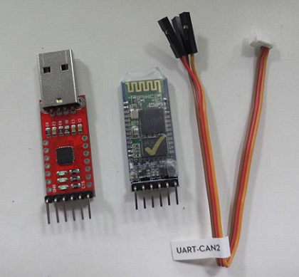
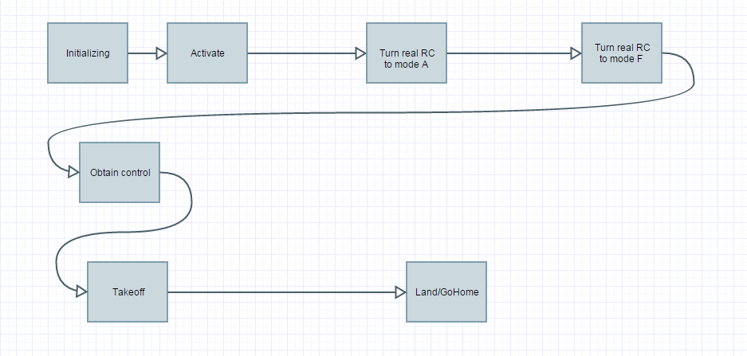

[English](#dji-onboard-stm32-example-program) |  [中文](#dji-onboard-stm32-例程)

#DJI Onboard STM32 例程
##简介
本工程使用stm32f407Discovery开发板测试，使用Keil uVision5编译。使用串口和开发板通信，发送指令。  
采用四线串口协议，如果PC上没有串口，建议使用USB转串口模块，如MAX232、PL2303、CP2102等
在使用本例程前请确认你已经**仔细阅读过**有关OnboardSDK的**[所有文档](https://developer.dji.com/cn/onboard-sdk/documentation/ProgrammingGuide/)**
##目录
1. [硬件接口](#硬件接口)
2. [开始使用](#开始使用)
   - [操作步骤](#操作步骤)
   - [指令格式](#指令格式)
   - [发送指令的顺序](#发送指令的顺序)
3. [动画示范](#动画示范)  

----------

##硬件接口
  使用USART2作为Debug通道。端口为PB10，PB11分别对应USART2的TX、RX，波特率为**115200**，此处的波特率必须和串口调试助手的波特率**一致**；  
使用USART3作为和M100上的N1飞控通信的接口。端口为PA2、PA3分别对应USART3的TX、RX，和N1飞控的“USART_CAN2”端口连接。波特率为 **921600**.此处的波特率必须和N1飞控的波特率**一致**，可以在DJI调参软件中调整；

##开始使用
>第一次使用前请连接手机和遥控器，并按照官网提示激活飞机。[更多关于激活](https://developer.dji.com/cn/onboard-sdk/documentation/ActivationGuide/)  
第一次激活后可以使用虚拟遥控功能替代实体遥控器  

###操作步骤
1. 将M100上电（**注意，测试时请将螺旋桨拆下**）

2. 待M100启动后将stm32与之连接。由于M100没有提供3/5V电源接口，**请自行给stm32供电**。

3. 用串口将PC和stm32连接起来，建议购入usb延长线、各种无线透传模块，方便调试。  

本例程中所有通信方式都**已经设置为不加密**，如果需要加密，请自行配置。

硬件正确配置后，复位stm32。如果一切正常，你将会看到M100发送回来的版本信息，此时可以向M100发送测试指令

###指令格式
---
+ 一帧指令由帧头，指令集，指令，数据(可选),帧尾 构成;  
- 第一第二个字节为帧头，固定为0xFA 0xFB。
- 第三、第四个字节为指令。
- 中间可能会有数据字节，
+ 最后一个字节为帧结束字节。

---
单片机接收到帧结束字节0xFE后会立即开始一次命令响应。

>注意：这里所指的指令是PC向stm32发送的命令，发送时请勾选**Hex发送**而不是ASCII发送。M100发回来的调试信息也会发送到
PC上，所以在PC上的串口调试助手中**发送端选择HEX发送**，**接收端选择ASCII接收**，波特率为115200

例如：0xFA 0xFB 0x02 0x01 0xFE

已经支持的命令如下，需要更多指令请自行添加

|指令内容           | 指令代码             |
|:-----------------|:------------------|  
| 获取当前版本信息   | 0xFA 0xFB 0x00 0xFE |
|发送激活指令 		| 0xFA 0xFB 0x01 0xFE | 
|请求控制权   		|0xFA 0xFB 0x02 0x01 0xFE|  
|释放控制权   	 	|0xFA 0xFB 0x02 0x00 0xFE | 
|一键返航  		 	|0xFA 0xFB 0x05 0x01 0xFE|  
|一键起飞  		 	|0xFA 0xFB 0x05 0x02 0xFE|  
|一键降落  		 	|0xFA 0xFB 0x05 0x03 0xFE|  

---  
###发送指令的顺序
指令的发送是有顺序的

正确的顺序如下

---
##动画示范
下面这个小动画演示了 读取版本信息->激活->打开虚拟遥控A档->虚拟遥控F档->获取控制权->一键起飞的过程

----------

#DJI Onboard STM32 Example Program
##Introduction
This project use stm32f407Discovery demoboard for testing,Keil uVision5 to complie.Use serial port interface to communicate with demoboard or send out command to M100.  
Use 4-wire-serial interface.If your computer do no has one,USB-TTL serial cable is necessary.CP2102 is recommend.Before using this example program,make sure you have **read all [documents](https://developer.dji.com/cn/onboard-sdk/documentation/ProgrammingGuide/) about OnboardSDK carefully.**  

##content
1. [Hardware Installation](#hardware-installation) 
2. [Getting Start](#getting-start)
   - [How to operate](#how-to-operate)
   - [Command Format](#command-format)
   - [How to send command](#how-to-send-command)
3. [Gif Demonstration](#gif-demonstration)

----------

##Hardware Installation
Use USART2 for debug.PB10,PB11 as TX,RX.BaudRate is **115200**.BaudRate here must be **the same as** BaudRate in your Serial debugging assistant.;

Use USART3 for communicating with M100.PA2,PA3 as TX,RX,which should be plug in the "USART_CAN2" prot.The BaudRate here should equal to BaudRate of N1 flight control system on M100,which can be adjust on
"DJI Assistant".

##Getting Start
>The first connection between stm32f4 and M100 **MUST** use your mobile device and remote control.[More about activate](https://developer.dji.com/cn/onboard-sdk/documentation/ActivationGuide/)  
>After the first activate,a VIRTUAL REMOTE CONTROL can take the place of remote control.  

###How to operate

1. power on your M100 **warning!:remove the propellers if you are no sure !!**
2. when it's booted,connect stm32 with M100.Since there is no 3v/5v power interface on M100.**Please settle it by yourself.**Using a 26v to 5v Voltage Converter or UBEC(Ultra Battery Elimination Circuit) or ever a carrying a POWER BANK is OK.
3. Connect stm32 with PC by serial interface.Extension cord and wireless seral port are recommened when you are doing a test.

All the communication in this program **has been set to UNENCRYPTED**.If necessary,configre it in the program by yourself.

If the Hardware has been set correctly,reset your stm32.If everything is ok,there would be a version infomation callback by M100.Therefrom,system is ready for your command.

###Command Format
---
+ The protocol frame consist of Frame Header,Command,Data(optional),Frame Footer;  
- The first and second byte is frame header.  
- The third and fourth is command .  
- Followed is data(optional).  
+ The last byte is frame booter.  

---

When the microcontroller receive a "0xfe" would lead to a command response immediately.  

>Attention:Please configure your serial debugging assistant on **Hex transmit** and **ASCII receive**,BuadRate is 115200.

For instance:  0xFA 0xFB 0x02 0x01 0xFE

Command as below has been added to program.More command should adapter by yourself if needed.

|Command          | Code for command             |
|:-----------------|:------------------|  
|Get current version   | 0xFA 0xFB 0x00 0xFE |
|Send activate information | 0xFA 0xFB 0x01 0xFE | 
|Obtain control   		|0xFA 0xFB 0x02 0x01 0xFE|  
|Relese control   	 	|0xFA 0xFB 0x02 0x00 0xFE | 
|Return to home(RTH)|0xFA 0xFB 0x05 0x01 0xFE|  
|Auto take off  	|0xFA 0xFB 0x05 0x02 0xFE|  
|Auto landing  		|0xFA 0xFB 0x05 0x03 0xFE|  

Amoug them, 0x04 0x01 means to choose the Localpositionnacigation.  
0x91 is the Control mode byte which is choosing *VERT_POS* ，*HORI_POS* ，*YAW_RATE*， *Ground系* ，*stable mode*.  

+ 0x00 0x00 is the distance of X direction is 0;
+ 0x00 0x00 is the distance of Y direction is 0;
+ 0x01 0xf4 is the distance of Z direction is 5.00m;
+ 0x00 0x00 is the Yaw direction don't rotate.
  

*Attention:The input of HORI_POS is a position offset instead of an actual position. This design aims to take both GPS flight and vision-based flight into consideration. If the developer wants to use GPS navigation, the GPS information sent by the UAV can be used to calculate position offset. While in vision-based flight application, developers should have their own positioning device (along with Gudiance or GPS to provide velocity measurement) to do position control. For example, xuhao1 SDK package implements a GPS-based position control where target position can be passed as GPS coordinate.*   

---  
###How to send command  
The command should be send in sequence.  

A normal order of it are as below:  

  

---
###Gif Demonstration
This little gif demonstrate how to send command using Serial debugging assistant.  
It shows a typical command flow like:
<<<<<<< HEAD
Read current version->Activate->Turn VRC to mode A->Turn VRC to mode F->Obtain control->Take off->GoHome.  

=======
Read current version->Activate->Turn VRC to mode A->Turn VRC to mode F->Obtain control->Take off->Start HotPoint->GoHome->Turn VRC.  

>>>>>>> c4aa4bc95a74ce337e423bccab6926e22945f2af
